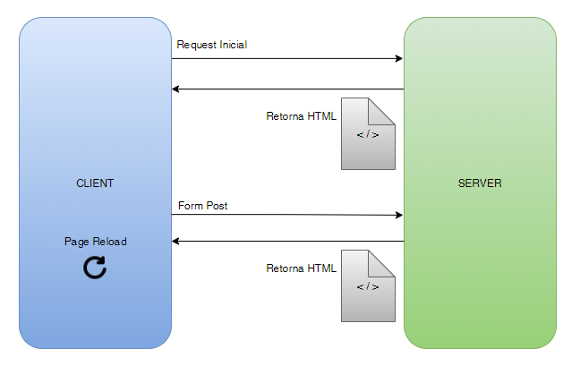
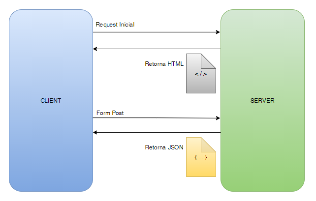

<div id="top"></div>

<br/>
<div align="center">
    
    
    <h1 align="center">SPA Angular Application</h1>
    <p align="center">Aplicação Web SPA com Type Script</p>
</div>

<br/>

<div align="center">
    <a href="https://github.com/YuriSiman/spa-angular-application/blob/master/LICENSE" target="_blank">
      
    </a>
    <a href="https://github.com/YuriSiman" target="_blank">
      
    </a>
    <a href="https://yurisiman.com.br" target="_blank">
      
    </a>
    <a href="https://www.linkedin.com/in/yurisiman/" target="_blank">
      
    </a>
    <a href="mailto:contato@yurisiman.com.br" target="_blank">
      
    </a>
</div>

<br/>

## :clipboard: Sobre o Projeto

O objetivo deste projeto é documentar o processo inicial da criação de uma aplicação SPA em Angular. Constam os principais comandos para preparar o ambiente e criar o projeto, assim como conceitos iniciais sobre o funcionamento de uma aplicação SPA em Angular, tendo o TypeScript como linguagem utilizada para o desenvolvimento.  :computer::coffee:

---

## :pencil: Pré-requisitos

1. Se você não possui o npm e node.js instalado, acesse [aqui](https://nodejs.org/en/) e instale a versão mais recente
2. Instalando o [Angular CLI](https://angular.io/cli)

   ```sh
   npm install -g @angular/cli
   ```

3. Clone este repositório em sua máquina local

   ```sh
   git clone https://github.com/YuriSiman/spa-angular-application.git
   ```
---

## :dart: Tópicos

<details>
  <summary>Comandos Iniciais</summary>
  <ul>
    <li><a href="#npm">npm</a></li>
    <li><a href="#ng">ng</a></li>
  </ul>
</details>

---

### Modelo Tradicional (server-side)  



<br/>

### Modelo Sigle Page Application (SPA)  



## :rocket: Vamos Começar

### Comandos Iniciais

<div id="npm"></div>

### npm    

Atualizando o npm para a sua última versão

```sh
npm install npm@latest -g
```

Atualizando o npm para uma versão específica (7.14.0 por exemplo)

```sh
npm install -g npm@7.14.0
```

Instalando o Angular CLI

```sh
npm install -g @angular/cli
```

<p align="right"><a href="#top">Início ↑</a></p>

---

<div id="ng"></div>

### ng  

Criando um projeto Angular

```sh
ng new Nome-Projeto
```

Criando um component

```sh
ng generate component Nome-Component

ou

ng g c Nome-Component
```

<p align="right"><a href="#top">Início ↑</a></p>

---

## :vertical_traffic_light: Status do Projeto

:construction: Projeto em construção :construction:

---

## :thinking: Contribuindo

> Passo a passo de como contribuir...

### Passo 1

* :fork_and_knife: Fork este repositório!

### Passo 2

* :dancers: Clone este repositório para sua máquina local usando `git clone https://github.com/YuriSiman/spa-angular-application.git`

### Passo 3

* :trident: Crie sua feature branch usando `git checkout -b minha-feature`

### Passo 4

* :white_check_mark: Commit suas mudanças usando `git commit -m "feat: Minha nova feature"`

### Passo 5

* :pushpin: Dê um push usando `git push -u origin minha-feature`

### Passo 6

* :arrows_clockwise: Crie um novo pull request

Depois que seu pull request for mesclado, você pode excluir sua feature branch  

> Caso tenha dúvidas, confira este guia de como [contribuir no GitHub](https://github.com/firstcontributions/first-contributions)  

---

## :speech_balloon: Suporte

> Entre em contato comigo...  

* Me chame pelo [Linkedin](https://www.linkedin.com/in/yurisiman/)  
* Me mande um e-mail [contato@yurisiman.com.br](mailto:contato@yurisiman.com.br)  

---

## :pencil: Licença

<a href="https://github.com/YuriSiman/spa-angular-application/blob/master/LICENSE" target="_blank">
  
</a>

##

Code your life :octocat:

<p align="right"><a href="#top">Início ↑</a></p>
