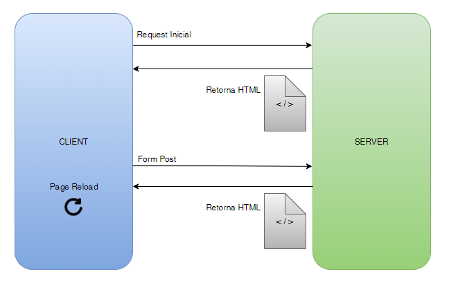
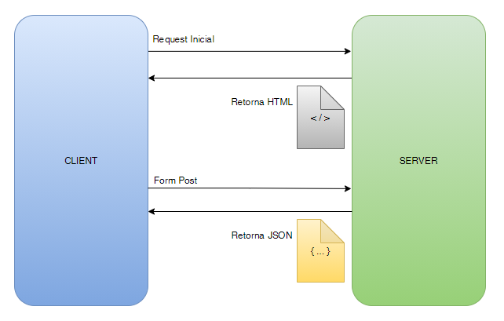

<h1 align="center">SPA Angular Application - TypeScript</h1>

---

### :dart: Objetivo

Tenho como objetivo documentar o passo a passo do processo de criar uma aplicação SPA em Angular com TypeScript, para que este projeto seja uma referência a estudos e criação de aplicações.

### Clone

Clone este repositório em sua máquina local usando:

```
git clone https://github.com/YuriSiman/spa-angular-application.git
```

---

## Modelo Tradicional (server-side)



## Modelo Single Page Application (SPA)



## Primeiros Passos

- Instalar o npm e [node.js](https://nodejs.org/en/)
- Verificando a versão do node.js e do npm:

```
node -v

npm -v
```

- Atualizando o npm para a sua última versão:

```
npm install npm@latest -g
```

- Atualizando o npm para uma versão específica (7.14.0 por exemplo):

```
npm install -g npm@7.14.0 
```

- Instalando o [Angular CLI](https://angular.io/cli)  

```
npm install -g @angular/cli
```

- Criando um projeto Angular

```
ng new Nome-Projeto
```

- Criando um component

```
ng generate component Nome-Component

ou

ng g c Nome-Component
```

---

## :rocket: Criando a Aplicação


---

## :thinking: Contribuindo

> Para começar...

### Passo 1

* :fork_and_knife: Fork este repositório!

### Passo 2

* :dancers: Clone este repositório para sua máquina local usando `git clone https://github.com/YuriSiman/spa-angular-application.git`

### Passo 3

* :trident: Crie sua feature branch usando `git checkout -b minha-feature`

### Passo 4

* :white_check_mark: Commit suas mudanças usando `git commit -m "feat: Minha nova feature"`

### Passo 5

* :pushpin: Dê um push usando `git push origin minha-feature`

### Passo 6

* :arrows_clockwise: Crie um novo pull request

Depois que seu pull request for mesclado, você pode excluir sua feature branch  

> Caso tenha dúvidas, confira este guia de como [contribuir no GitHub](https://github.com/firstcontributions/first-contributions)  

---

## :speech_balloon: Suporte

> Entre em contato comigo...  

* Me chame pelo [Linkedin](https://www.linkedin.com/in/yurisiman/)  
* Me mande um e-mail [contato@yurisiman.com.br](mailto:contato@yurisiman.com.br)  

[](https://github.com/YuriSiman)  
[](https://yurisiman.com.br)  

---

## :pencil: Licença

[](https://github.com/YuriSiman/spa-angular-application/blob/master/LICENSE)   

---

Code your life...
